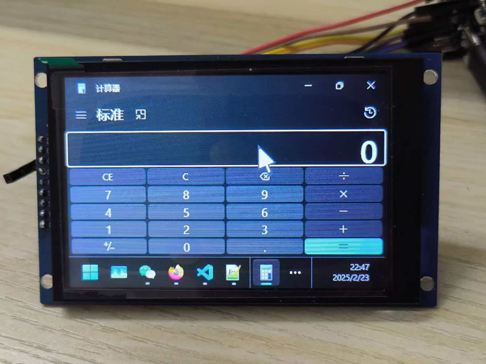
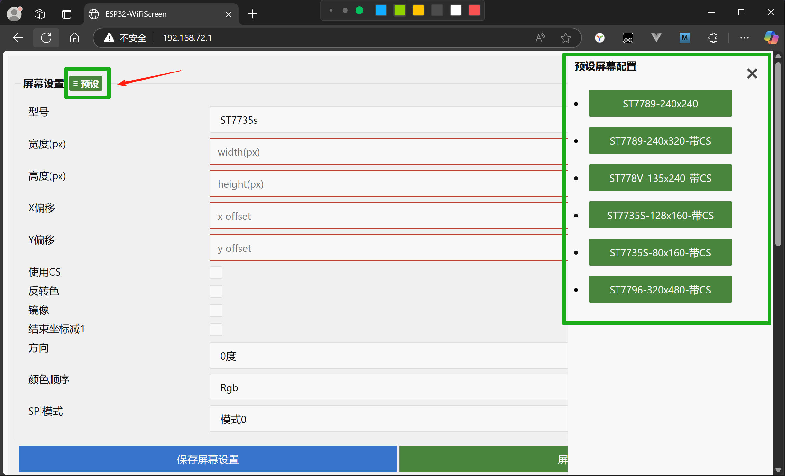
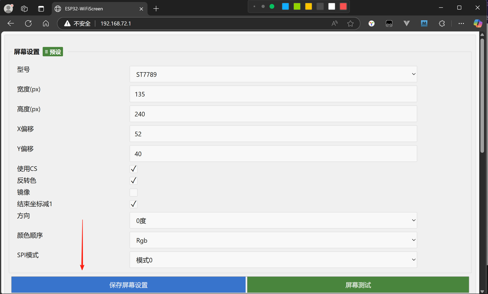
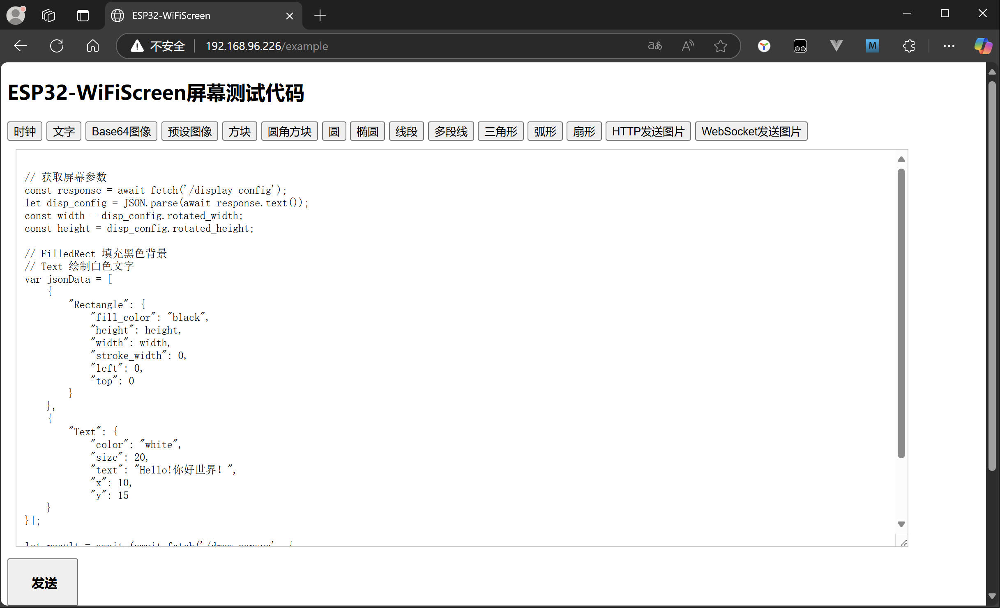
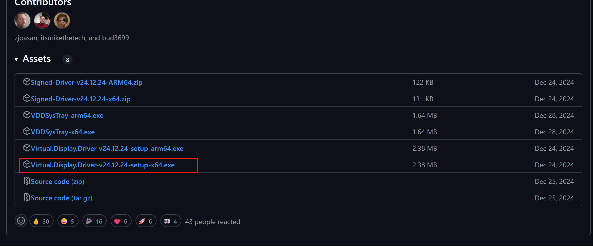
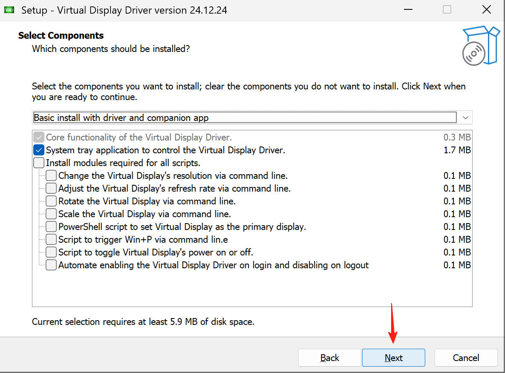
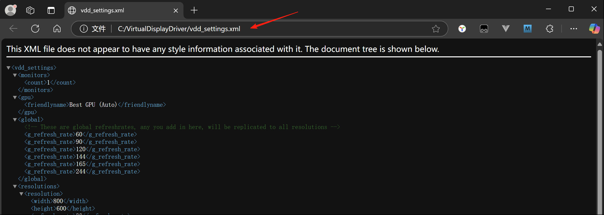
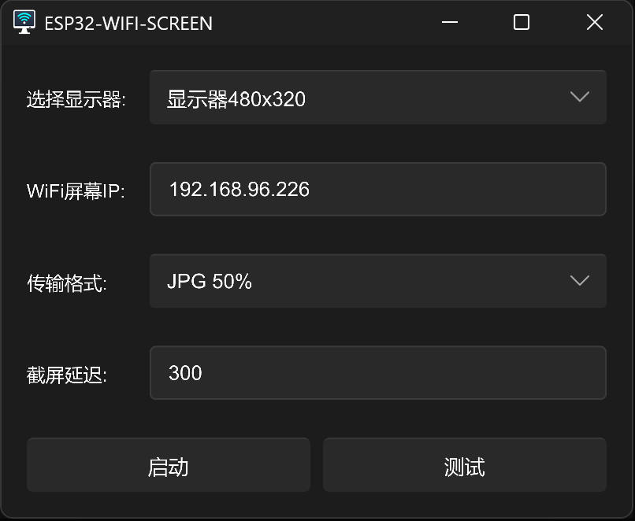

# esp32-wifi-screen
ESP32 S2 WiFi Screen

A WiFi screen based on ESP32 S2, providing HTTP interface, WebSocket interface, and MQTT client to control screen display content. Currently supported screen models: ST7735S, ST7789/ST7789V, ST7796. Tested screens include: ST7735S 80x160, ST7735S 128x160, ST7789 240x240, ST7789 240x320, ST7789V 135x240, ST7796 320x480.





## ESP32 S2 Development Board

The ESP32 S2 development board must have 4M Flash with 2M PSRAM. Otherwise, this firmware cannot run.

## Wiring

For the connection method between ESP32 S2 and screen module, refer to the wiring documentation for the corresponding screen in the "[wiring](https://github.com/planet0104/esp32-wifi-screen/tree/main/scr/%E6%8E%A5%E7%BA%BF)" directory of the firmware source code.


# Flash Firmware

## Switch ESP32 S2 to Flash Mode
Hold the Boot button and start the ESP32-S2 development board, the chip will enter flash mode. The ESP32 serial port will appear in the device manager.


## Flash Using esptool
```powershell
.\esptool.exe -p COM6 --before default_reset --after hard_reset --chip esp32s2 write_flash 0x1000 .\bootloader.bin 0x8000 .\partitions.bin 0x10000 esp32-wifi-screen.bin
```

# Configure WiFi Screen

## Connect to ESP32-WiFiScreen
After successfully flashing the firmware, restart ESP32 S2, and connect to the hotspot "ESP32-WiFiScreen" on your computer (or phone).


Then enter "http://192.168.72.1" in the browser to open the configuration interface.


## Set Screen Parameters

Click the "Preset" button in the upper left corner to select the screen model, or you can modify the screen parameters yourself.



After setting the screen parameters, click "Save Screen Settings". At this time, ESP32 S2 will restart automatically. After restart, reconnect to the "ESP32-WiFiScreen" hotspot. Then enter "http://192.168.72.1" in the browser again to open the configuration interface.



## Screen Color Adjustment

Find the "Color Adjustment" form in the configuration interface to adjust the RGB color tone of the screen in real-time. If the screen display is blue-tinted or yellow-tinted, you can use the quick preset buttons or manually drag the sliders to adjust.


### Features

- **Quick Presets**: Provides four common presets: Fix Blue Tint, Fix Yellow Tint, Warm Tone, and Cool Tone
- **Manual Adjustment**: Can adjust Red (R), Green (G), and Blue (B) channels separately, with adjustment range from -100 to +100
- **Real-time Preview**: The screen will immediately refresh to display the adjusted effect when dragging the slider
- **Reset Function**: Click the "Reset to 0" button to restore all color adjustments to default values

Note: Color adjustments take effect in real-time and are saved to the device without requiring a restart.

## Set WiFi Name and Password

### WiFi Scan Function

In the WiFi configuration form, click the "Scan Nearby WiFi" button, and the device will automatically scan nearby WiFi networks and display them in the dropdown list. Each WiFi will show the name and signal strength. After selecting WiFi, the SSID will be automatically filled into the input box.

### Manual WiFi Input

You can also manually enter the WiFi name and password in the WiFi configuration form, the device IP does not need to be entered. Then click "Save Network Settings". Wait for ESP32 S2 to restart.

### Real-time WiFi Reconnect

After configuration, you can click the "Real-time WiFi Reconnect" button to reconnect to WiFi without restarting the device (partial effect, complete reconnection may require restart).


Enter "http://192.168.72.1" in the browser again to open the configuration interface. At this time, you can see the device's LAN IP address in the WiFi configuration form. Now connect the computer's WiFi to the original router. Enter the device's LAN IP address in the browser to reopen the configuration interface.


## Set MQTT Remote Server (Optional)

In the MQTT configuration form of the settings interface, you can configure the MQTT remote server. After configuration, ESP32 S2 will try to connect to the MQTT server every time it starts.


If you no longer need to connect to the MQTT remote server, clear the form fields, then click "Save", and the MQTT connection will be disconnected after restart.


### Real-time MQTT Reconnect

After configuration, you can click the "Real-time MQTT Reconnect" button to reconnect to the MQTT server without restarting the device. Click the "Delete MQTT Settings" button to immediately clear the MQTT configuration and disconnect.

## Test Screen

In the browser, open the settings interface and click the "Screen Test Button" below the screen parameter form to jump to the test page.


Click to select different test buttons, then click "Send" in the lower left corner to run the sample code in the input box. When calling the WiFi screen API in other programming languages, please refer to the data format in the sample code.




## Transmission Speed Test

Find the "Transmission Speed Test" form in the configuration interface to test the speed of HTTP and WebSocket transmission methods.

### Test Steps

1. Select test data size (10KB ~ 1MB)
2. Click the "Test HTTP" button to test HTTP transmission speed
3. Click the "Test WebSocket" button to test WebSocket transmission speed
4. Test results will display transmission rate (KB/s or MB/s) and time consumed
5. Test log will display detailed test process information

Generally, WebSocket transmission speed is faster than HTTP and is more suitable for real-time screen updates.

## Nodejs, Python and Rust Sample Code

If you want to control through code in other programming languages, refer to the [examples](https://github.com/planet0104/esp32-wifi-screen/tree/main/scr/examples) directory in the firmware source code for nodejs, python, and rust code examples.

# WiFi-Screen-Client

A client that outputs screen mirroring to the WiFi screen through system screenshot. It is recommended to first install [Virtual Display Driver](https://github.com/VirtualDisplay/Virtual-Display-Driver) and add a virtual display with appropriate size and ratio.

## Install Virtual Display Driver

Open the Virtual Display Driver Github download page:
https://github.com/VirtualDisplay/Virtual-Display-Driver/releases/tag/24.12.24

Download the latest version installer ([Virtual.Display.Driver-v24.12.24-setup-x64.exe](https://github.com/VirtualDisplay/Virtual-Display-Driver/releases/download/24.12.24/Virtual.Display.Driver-v24.12.24-setup-x64.exe)):



Run the installer and follow the default steps to install.




After installation, start the Virtual Display Driver tray program.


Right-click the Virtual Display Driver tray icon and click the "Loaded from vdd_settings.xml" menu item.


Copy the complete vcc_settings.xml in the opened browser interface and open it in a text editor.



Delete the excess screen configurations and keep only the ones you need. For example, if my screen is ST7789 240x240, then I can set the resolution to 480x480 with the same ratio. If the resolution is too small, the application window may not be able to move over or display completely.


Click the Virtual Display Driver tray icon again and click the "Reload Settings" menu item to refresh the virtual screen configuration. If it doesn't work, click it a few more times and wait a moment.


At this time, open the system screen settings and you can see a virtual small display. Confirm that the selected resolution is correct.
If the modified resolution configuration does not take effect, try clicking the "Reload Driver" or "Disable Driver" menu of the Virtual Display Driver tray to restart the virtual display driver. Then in the system screen settings, move the small screen position and click apply. The screen will refresh to the modified resolution.


## Connect to WiFi Display

Enter the IP address of the WiFi display, and after testing is successful, click the "Start" button.

The larger the screen resolution, the slower the screen refresh speed, so you should appropriately increase the delay time (ms).




After successful connection, the screen content of the virtual display will be displayed on the WiFi screen.

# USB Screen Client

[USB Screen & Editor](https://github.com/planet0104/USB-Screen) is also adapted for WiFi screen, just configure the IP address to connect.


