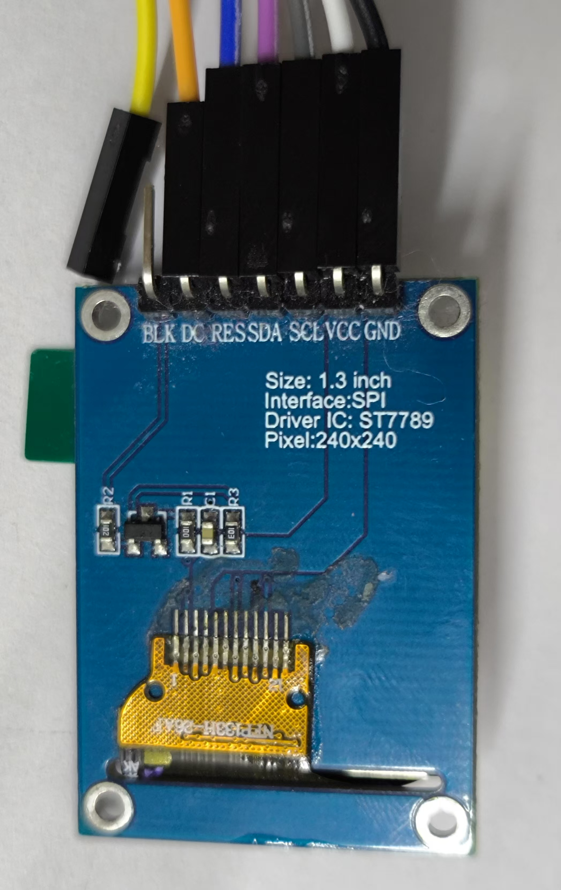

# ESP32 WiFi Screen

基于 **ESP32-S2 / ESP32-S3** 的小屏幕项目，支持通过 **WiFi**（HTTP/WebSocket/MQTT）或 **USB 串口** 高速传输图像并显示到 TFT 屏幕。

## 目录结构

本仓库已将 ESP32 固件项目移动到仓库根目录（不再有 `scr/` 子项目），常用目录如下：

| 目录/文件 | 说明 |
|---|---|
| `src/` | 固件核心代码（HTTP/WebSocket/MQTT、USB 串口、显示驱动封装、画布/绘图等） |
| `html/` | Web 配置界面静态页面（设备端提供访问） |
| `images/` | 接线图与使用截图（README 引用的图片都在这里） |
| `tools/examples/` | 上位机示例（Nodejs、Python、Rust；以及 USB 串口示例） |
| `tools/speedtest/` | 串口测速与发送图片脚本（Nodejs） |
| `tools/wifi-screen-client/` | 屏幕镜像客户端（截屏推流到 WiFi 屏幕） |
| `mipidsi/` | 显示屏驱动子 crate（上游/定制代码） |
| `build_esp32s2.ps1`/`flash_esp32s2.ps1` | ESP32-S2 构建/烧录脚本 |
| `build_esp32s3.ps1`/`flash_esp32s3.ps1` | ESP32-S3 构建/烧录脚本 |
| `esp32-wifi-screen-esp32s2-merged.bin`/`esp32-wifi-screen-esp32s3-merged.bin` | 预编译完整镜像（merged binary，可直接从 0x0 烧录） |

## 功能特性

- **多种显示屏支持**：ST7735S、ST7789/ST7789V、ST7796 系列 TFT 显示屏
- **多种通信方式**：HTTP API、WebSocket、MQTT、USB 串口（ESP32-S2 USB CDC / ESP32-S3 USB Serial JTAG）
- **Web 配置界面**：通过浏览器配置 WiFi、显示屏参数
- **图像传输**：支持 JPEG、RGB565、LZ4 压缩格式
- **画布绘制**：支持文字、图形、图像等元素绘制
- **色调调整**：实时调整屏幕 RGB 通道，修正色偏问题

## 硬件要求

- ESP32-S2 或 ESP32-S3 开发板（带 PSRAM，建议 4MB Flash + 2MB PSRAM）
- 支持的 TFT 显示屏（见下方接线说明）
- USB 数据线（用于烧写/日志/USB 串口传图）

## 屏幕接线说明

### 通用引脚定义

| 显示屏引脚 | ESP32 引脚 | 说明 |
|-----------|--------------|------|
| GND | GND | 接地 |
| VCC | 3V3 | 电源 3.3V |
| SCL/CLK | GPIO6 | SPI 时钟 |
| SDA/MOSI | GPIO7 | SPI 数据 |
| RST/RES | GPIO8 | 复位 |
| DC/AO | GPIO5 | 数据/命令选择 |
| CS | GPIO4 | 片选（部分屏幕需要） |
| BL/BLK | 悬空或 VBUS | 背光（可接 VBUS 5V） |

### 各屏幕接线参考

#### ST7735S 80x160（带 CS）


```
GND -> GND
VCC -> 3V3
SCL -> GPIO6
SDA -> GPIO7
RST -> GPIO8
DC  -> GPIO5
CS  -> GPIO4
BLK -> (悬空或 VBUS)
```

#### ST7735S 128x160（带 CS）


```
GND -> GND
VCC -> 3V3
SCL -> GPIO6
SDA -> GPIO7
RST -> GPIO8
DC  -> GPIO5
CS  -> GPIO4
BL  -> (悬空或 VBUS)
```

#### ST7789 240x240（无 CS）



```
GND -> GND
VCC -> 3V3
SCL -> GPIO6
SDA -> GPIO7
RES -> GPIO8
DC  -> GPIO5
BLK -> (悬空或 VBUS)
```

#### ST7789 240x320（带 CS）


```
GND -> GND
VCC -> 3V3
SCL -> GPIO6
SDA -> GPIO7
RST -> GPIO8
AO  -> GPIO5
CS  -> GPIO4
BL  -> VBUS
```

#### ST7789V 135x240（带 CS）


```
GND -> GND
VCC -> 3V3
SCL -> GPIO6
SDA -> GPIO7
RES -> GPIO8
DC  -> GPIO5
CS  -> GPIO4
BLK -> (悬空或 VBUS)
```

#### ST7796 320x480（带 CS）


```
GND -> GND
VCC -> 3V3
SCL -> GPIO6
SDA -> GPIO7
RST -> GPIO8
DC  -> GPIO5
CS  -> GPIO4
BL  -> VBUS
```

## 烧录固件

### 方式一：使用仓库内置 merged bin + esptool（最省事）

1. 让开发板进入烧录模式：按住 Boot 并上电/复位进入下载模式，系统会出现串口设备


2. 使用 `esptool.exe` 直接从 `0x0` 写入完整镜像：

#### ESP32-S2

```powershell
.\esptool.exe -p COM6 --before default_reset --after hard_reset --chip esp32s2 write_flash 0x0 esp32-wifi-screen-esp32s2-merged.bin
```

#### ESP32-S3

```powershell
.\esptool.exe -p COM6 --before default_reset --after hard_reset --chip esp32s3 write_flash 0x0 esp32-wifi-screen-esp32s3-merged.bin
```

> 说明：merged binary 已包含 bootloader、partition table 和 app，无需分段烧录。

### 方式二：从源码构建并烧录（适合二次开发）

- 构建脚本：`build_esp32s2.ps1` / `build_esp32s3.ps1`
- 烧录脚本：`flash_esp32s2.ps1` / `flash_esp32s3.ps1`
- 注意：ESP-IDF 构建路径长度有限制，建议在 `.cargo/config.toml` 配置 `target-dir` 为短路径（例如 `C:/esp/target`）

## 配置 WiFi 与屏幕参数（Web 配置界面）

固件烧录后设备会开启 AP 热点，SSID 通常类似 `ESP32-WiFiScreen` 或 `ESP32-Screen-XXXXXX`，以设备实际广播为准。

1. 连接设备热点


2. 浏览器访问 `http://192.168.72.1` 打开配置界面


3. 设置屏幕参数：点击左上角“预设”选择屏幕型号，或手动修改


4. 保存屏幕设置后设备会重启，重新连接热点再继续配置


### 屏幕色调调整

可在配置界面中实时调整 RGB 通道，修正偏蓝/偏黄等色偏问题：


### WiFi 扫描与连接路由器

- 支持扫描附近 WiFi 并自动填充 SSID
- 保存网络设置后设备重启，之后可在配置界面查看设备的局域网 IP，再用局域网 IP 访问配置界面


### MQTT（可选）

配置 MQTT 后设备启动会自动连接；也支持实时重连与清除配置：


### 屏幕测试与速度测试

- 屏幕测试：配置页可进入测试页面，选择示例后点击“发送”
- 速度测试：可测试 HTTP 与 WebSocket 的吞吐


## USB 串口传图

### 适用芯片

- ESP32-S2：TinyUSB CDC（固件启动后会输出 `READY:USB-CDC`）
- ESP32-S3：USB Serial JTAG（固件启动后会输出 `READY:HIGH_SPEED_RX`）

### 上位机示例

- 示例工程：`tools/examples/`
- Rust 示例入口：`tools/examples/src/main.rs`（会自动查找 usb-screen 设备并发送图像）

### 串口通信协议（固件侧：`src/usb_reader.rs`）

- 设备信息查询（ReadInfo）
  - 主机发送：`ReadInfo`（8 字节二进制）或 ASCII `ReadInfo\n`
  - 设备回复：`ESP32-WIFI-SCREEN;{width};{height};PROTO:USB-SCREEN`
- 图像帧传输（LZ4 + RGB565）
  - 帧头：`image_aa`（8 字节） + `width,height,x,y`（4 个 `u16`，Big-Endian，共 8 字节）
  - 负载：`lz4_flex::compress_prepend_size(rgb565_bytes)` 输出
  - 帧尾：`image_bb`（8 字节）
- 测速（SpeedTest）
  - 主机发送：`SPDTEST1`（8 字节） + 任意数据 + `SPDEND!!`（8 字节）
  - 设备回复：`SPEEDRESULT;{bytes};{ms}`（为提高可靠性会重复发送）

## 性能测试

### WiFi 传输速度（ESP32-S2 @ 240MHz + 2MB PSRAM）

| 协议 | 最低速度 | 最高速度 | 典型速度 | 备注 |
|------|----------|----------|----------|------|
| HTTP Echo | 120 KB/s | 694 KB/s | ~280 KB/s | 单次请求/响应 |
| WebSocket Echo | 128 KB/s | 751 KB/s | ~350 KB/s | 长连接，性能更稳定 |

> 测试条件：100KB 数据往返测试（Echo），WiFi 2.4GHz，实际速度受信号强度和环境干扰影响。

### USB 串口传输速度（ESP32-S2/S3）

| 项目 | 主机侧吞吐 | 设备侧接收 | 备注 |
|------|------------|------------|------|
| USB 串口单向下行（SpeedTest） | ~462.6 KB/s | ~491.0 KB/s | chunk=4096，设备输出 `SPEEDRESULT;5050368;10045` |

> 说明：Nodejs 脚本在 `tools/speedtest/`，包含测速与发送图片的示例（例如 `serial_speed_test.js`、`send_image.js`）。

### 性能说明

- WiFi 峰值速度：约 750 KB/s（6 Mbps），接近 ESP32-S2 WiFi 理论极限
- WiFi 速度波动：2.4GHz WiFi 环境干扰会导致速度波动
- WebSocket 优势：长连接避免了 HTTP 连接开销，平均速度更高
- USB 串口典型速度：约 450 到 500 KB/s（与主机驱动、串口栈缓冲、chunk 大小等有关）

## WiFi-Screen-Client（屏幕镜像客户端）

仓库内置一个客户端，通过系统截屏方式将屏幕镜像输出到 WiFi 屏幕：

- 客户端目录：`tools/wifi-screen-client/`
- 建议配合安装 Virtual Display Driver 创建虚拟显示器，便于将窗口完整移动到虚拟屏幕进行截屏推流

Virtual Display Driver：
- 项目主页：`https://github.com/VirtualDisplay/Virtual-Display-Driver`

参考流程（截图在 `images/`）：
- 安装驱动：`images/vdd0.jpg` 到 `images/vdd6.jpg`
- 调整虚拟屏幕分辨率与刷新配置：`images/vdd7.jpg` 到 `images/vdd12.jpg`
- 连接客户端并开始镜像：`images/client0.jpg`、`images/client.jpg`

## 其他语言示例

在 `tools/examples/` 中提供了 Nodejs、Python、Rust 示例代码，可用于通过 HTTP/WebSocket/MQTT/USB 串口控制屏幕。

## License

MIT License
