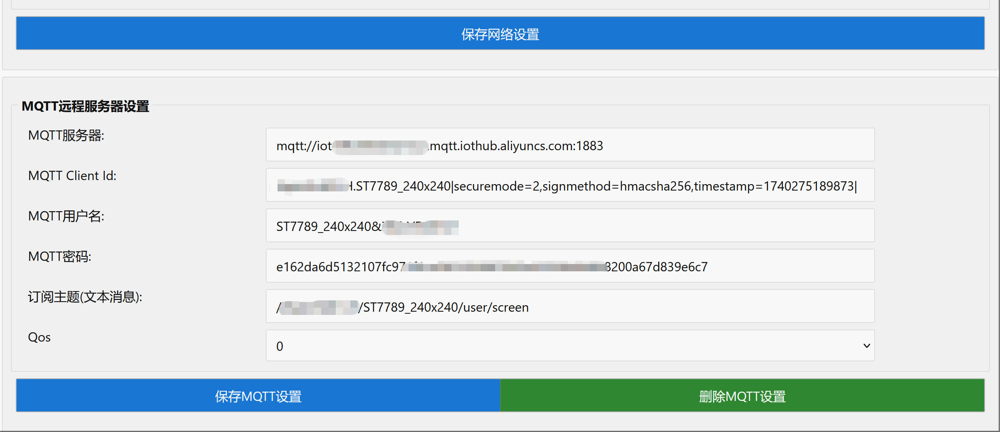

# esp32-wifi-screen
 ESP32 S2 wifi screen
 
 基于ESP32 S2开发的一个WiFi屏幕，固件提供HTTP接口、Websocket接口，以及Mqtt客户端三种方式控制屏幕显示内容。目前支持的屏幕型号有：ST7735S、ST7789/ST7789V、ST7796。测试过的屏幕包括：ST7735S 80x160、ST7735S 128x160、ST7789 240x240、ST7789 240x320、ST7789V 135x240、ST7796 320x480。

 

 

 

 

 ## ESP32 S2开发板

 ESP32 S2开发板必须是4M Flash，带2M PSRAM的版本。否则无法运行此固件。

 ## 接线方式

ESP32 S2和屏幕模块的连接方式，参考在固件源码中的“[接线](https://github.com/planet0104/esp32-wifi-screen/tree/main/scr/%E6%8E%A5%E7%BA%BF)”目录对应屏幕的接线方式说明文档。


# 烧录固件

## ESP32 S2切换到烧录模式
按住 Boot 按钮并启动 ESP32-S2 开发板，芯片会进入 烧录模式。设备管理器出现ESP32串口。


## 使用esptool烧录
```powershell
.\esptool.exe -p COM6 --before default_reset --after hard_reset --chip esp32s2 write_flash 0x1000 .\bootloader.bin 0x8000 .\partitions.bin 0x10000 esp32-wifi-screen.bin
```

# 配置WiFi屏幕

## 连接ESP32-WiFiScreen
固件烧录成功后，重新启动ESP32 S2，在电脑(或手机)上连接热点"ESP32-WiFiScreen"


然后在浏览器输入 “http://192.168.72.1” ，打开配置界面


## 设置屏幕参数

点击左上角“预设”按钮，选择屏幕的型号，也可以自己修改屏幕参数。


设置好屏幕参数后，点击“保存屏幕设置”。此时ESP32 S2会自动重启。重启后，重新连接"ESP32-WiFiScreen"热点。然后再次在浏览器输入 “http://192.168.72.1” ，打开配置界面。


## 设置WiFi名和密码

找到页面中的WiFi配置表单，输入WiFi名字和密码，设备IP不必输入。然后点击“保存网络设置”。等待ESP32 S2重启完成。


再次在浏览器输入 “http://192.168.72.1” ，打开配置界面。此时可在WiFi配置表单中，查看到设备的局域网IP地址。此时将电脑的WiFi连接到原先的路由器上。在浏览器输入设备的局域网IP地址，重新打开配置界面。


## 设置MQTT远程服务器(可选)

在设置界面中的MQTT配置表单中，可配置mqtt远程服务器，配置完成后，ESP32 S2在每次启动后，会尝试连接mqtt服务器。



如果不再需要连接mqtt远程服务器，清空表单字段，然后点击“保存”，重启后会断开mqtt连接。


## 测试屏幕

在浏览器打开设置界面，点击在屏幕参数表单下边“屏幕测试按钮”跳转到测试页面。


点击选择不同的测试按钮，然后再点击左下角的“发送”运行输入框中的示例代码。在其他编程语言中调用WiFi屏幕api的时候，请参考示例代码中的数据格式。


## Nodejs、python和rust示例代码

如果你要在其他编程语言中，通过代码控制，参考在固件源码中的[examples](https://github.com/planet0104/esp32-wifi-screen/tree/main/scr/examples)目录中有nodejs、python、以及rust代码示例。

# WiFi-Screen-Client

一个客户端，通过系统截屏方式，将屏幕镜像输出到WiFi屏幕上。建议先安装[Virtual Display Driver](https://github.com/VirtualDisplay/Virtual-Display-Driver)，并添加一个大小、比例合适的虚拟显示器。

## 安装Virtual Display Driver

打开 Virtual Display Driver的Github下载页:
https://github.com/VirtualDisplay/Virtual-Display-Driver/releases/tag/24.12.24

下载最新版本的安装包( [Virtual.Display.Driver-v24.12.24-setup-x64.exe](https://github.com/VirtualDisplay/Virtual-Display-Driver/releases/download/24.12.24/Virtual.Display.Driver-v24.12.24-setup-x64.exe)):


运行安装程序，按照默认步骤安装。


安装完成后，启动Virtual Display Driver托盘程序。


右键点击Virtual Display Driver托盘图标，点击"Loaded from vdd_settings.xml"菜单项


在打开的浏览器界面中复制完整的vcc_settings.xml，并在文本编辑器中打开它。


删掉多余的屏幕配置，只留下需要的。例如我的屏幕是ST7789 240x240，那么可以将分辨率设置成相同比例的480x480。分辨率太小的话，应用窗口可以无法移动过去，或者完全显示。


再次点击Virtual Display Driver托盘图标，点击"Reload Settings"菜单项，刷新虚拟屏幕配置。如果无效可多点击几次，稍等片刻。


这个时候，打开系统屏幕设置，可看到一个虚拟的小显示器。确认选择的分辨率是正确的。
如果修改的分辨率配置没有生效，尝试点击Virtual Display Driver托盘菜单的"Reload Driver"，或者"Disable Driver"，重新启动虚拟显示器驱动。然后在系统屏幕设置中，移动小屏位置，然后点击应用。屏幕就会刷新到修改后的分辨率。


## 连接WiFi显示器

输入WiFi显示器的IP地址，测试通过后，点击“启动”按钮即可。

屏幕分辨率越大，屏幕刷新速度越慢，要适当增加延迟时间(ms)。


连接成功后，虚拟显示器的屏幕内容，就会显示到WiFi屏幕上。

# USB Screen客户端

[USB屏幕&编辑器](https://github.com/planet0104/USB-Screen) 也适配了WiFi屏幕，配置好IP地址即可连接。


