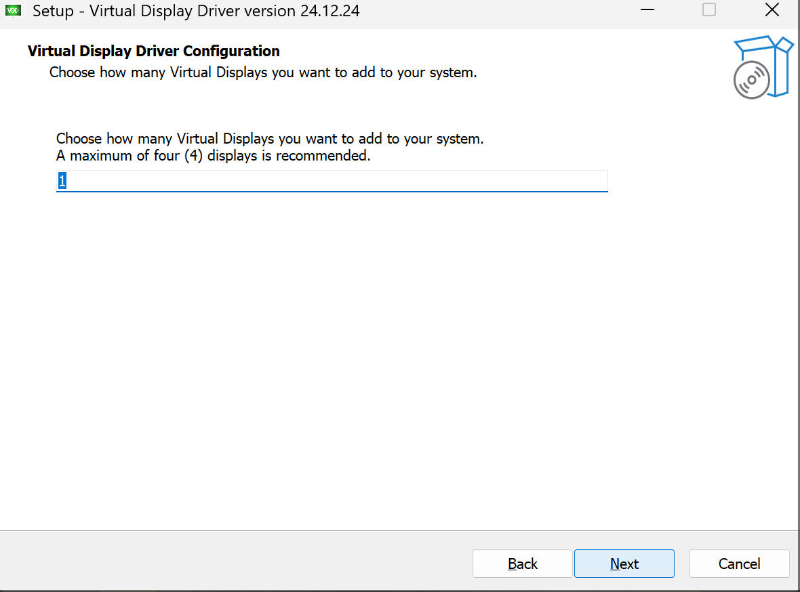

# esp32-wifi-screen
 ESP32-S2/S3 WiFi Screen
 
 基于 ESP32-S2/S3 开发的 WiFi 屏幕，固件提供 HTTP 接口、WebSocket 接口，以及 MQTT 客户端三种方式控制屏幕显示内容。目前支持的屏幕型号有：ST7735S、ST7789/ST7789V、ST7796。测试过的屏幕包括：ST7735S 80x160、ST7735S 128x160、ST7789 240x240、ST7789 240x320、ST7789V 135x240、ST7796 320x480。

 

 

 

 

 ## ESP32-S2/S3 开发板

 ESP32-S2 或 ESP32-S3 开发板必须是 4MB Flash + 2MB PSRAM 的版本，否则无法运行此固件。两款芯片均已完全支持。

 ## 接线方式

ESP32-S2/S3 和屏幕模块的连接方式，参考固件源码中的"[README文档](https://github.com/planet0104/esp32-wifi-screen/tree/main/scr/README.md)"。


# 烧录固件

## 切换到烧录模式
按住 Boot 按钮并启动 ESP32-S2/S3 开发板，芯片会进入烧录模式。设备管理器会出现 ESP32 串口。


## 使用 esptool 烧录

### ESP32-S2
```powershell
.\esptool.exe -p COM6 --before default_reset --after hard_reset --chip esp32s2 write_flash 0x0 esp32-wifi-screen-esp32s2-merged.bin
```

### ESP32-S3
```powershell
.\esptool.exe -p COM6 --before default_reset --after hard_reset --chip esp32s3 write_flash 0x0 esp32-wifi-screen-esp32s3-merged.bin
```

> **说明**: 现在使用完整镜像文件（merged binary），直接从 0x0 地址烧录，无需分别烧录 bootloader、partition table 和 app。

# 配置WiFi屏幕

## 连接 ESP32-WiFiScreen
固件烧录成功后，重新启动 ESP32-S2/S3，在电脑（或手机）上连接热点 "ESP32-WiFiScreen"


然后在浏览器输入 “http://192.168.72.1” ，打开配置界面


## 设置屏幕参数

点击左上角“预设”按钮，选择屏幕的型号，也可以自己修改屏幕参数。


设置好屏幕参数后，点击“保存屏幕设置”。此时ESP32 S2会自动重启。重启后，重新连接"ESP32-WiFiScreen"热点。然后再次在浏览器输入 “http://192.168.72.1” ，打开配置界面。


## 屏幕色调调整

在配置界面中找到"色调调整"表单，可以实时调整屏幕的RGB色调。如果屏幕显示颜色偏蓝或偏黄，可以使用快捷预设按钮或手动拖动滑块调整。


### 功能说明

- **快捷预设**：提供修复偏蓝、修复偏黄、暖色调、冷色调四种常用预设
- **手动调整**：可以分别调整红(R)、绿(G)、蓝(B)三个通道，调整范围为-100到+100
- **实时预览**：拖动滑块时屏幕会立即刷新显示调整后的效果
- **重置功能**：点击"重置为0"按钮可将所有色调调整恢复到默认值

注意：色调调整会实时生效并保存到设备中，无需重启。
## 设置WiFi名和密码

### WiFi扫描功能

在WiFi配置表单中，点击"扫描附近WiFi"按钮，设备会自动扫描周围的WiFi网络并显示在下拉列表中。每个WiFi会显示名称和信号强度。选择WiFi后，SSID会自动填入输入框。

### 手动输入WiFi

也可以直接在WiFi配置表单中手动输入WiFi名字和密码，设备IP不必输入。然后点击"保存网络设置"。等待ESP32 S2重启完成。

### 实时重连WiFi

配置完成后，可以点击"实时重连WiFi"按钮，无需重启设备即可重新连接WiFi（部分生效，完整重连可能需要重启）。


再次在浏览器输入 “http://192.168.72.1” ，打开配置界面。此时可在WiFi配置表单中，查看到设备的局域网IP地址。此时将电脑的WiFi连接到原先的路由器上。在浏览器输入设备的局域网IP地址，重新打开配置界面。


## 设置MQTT远程服务器(可选)

在设置界面中的MQTT配置表单中，可配置mqtt远程服务器，配置完成后，ESP32 S2在每次启动后，会尝试连接mqtt服务器。


如果不再需要连接mqtt远程服务器，清空表单字段，然后点击“保存”，重启后会断开mqtt连接。


### 实时重连MQTT

配置完成后，可以点击"实时重连MQTT"按钮，无需重启设备即可重新连接MQTT服务器。点击"删除MQTT设置"按钮可以立即清除MQTT配置并断开连接。
## 测试屏幕

在浏览器打开设置界面，点击在屏幕参数表单下边“屏幕测试按钮”跳转到测试页面。


点击选择不同的测试按钮，然后再点击左下角的“发送”运行输入框中的示例代码。在其他编程语言中调用WiFi屏幕api的时候，请参考示例代码中的数据格式。


## 传输速度测试

在配置界面中找到"传输速度测试"表单，可以测试HTTP和WebSocket两种传输方式的速度。

### 测试步骤

1. 选择测试数据大小（10KB ~ 1MB）
2. 点击"测试HTTP"按钮测试HTTP传输速度
3. 点击"测试WebSocket"按钮测试WebSocket传输速度
4. 测试结果会显示传输速率（KB/s或MB/s）和耗时
5. 测试日志会显示详细的测试过程信息

一般情况下，WebSocket传输速度会比HTTP更快，更适合实时屏幕更新。
## Nodejs、python和rust示例代码

如果你要在其他编程语言中，通过代码控制，参考在固件源码中的[examples](https://github.com/planet0104/esp32-wifi-screen/tree/main/scr/examples)目录中有nodejs、python、以及rust代码示例。

# WiFi-Screen-Client

一个客户端，通过系统截屏方式，将屏幕镜像输出到WiFi屏幕上。建议先安装[Virtual Display Driver](https://github.com/VirtualDisplay/Virtual-Display-Driver)，并添加一个大小、比例合适的虚拟显示器。

## 安装Virtual Display Driver

打开 Virtual Display Driver的Github下载页:
https://github.com/VirtualDisplay/Virtual-Display-Driver/releases/tag/24.12.24

下载最新版本的安装包( [Virtual.Display.Driver-v24.12.24-setup-x64.exe](https://github.com/VirtualDisplay/Virtual-Display-Driver/releases/download/24.12.24/Virtual.Display.Driver-v24.12.24-setup-x64.exe)):


运行安装程序，按照默认步骤安装。





安装完成后，启动Virtual Display Driver托盘程序。


右键点击Virtual Display Driver托盘图标，点击"Loaded from vdd_settings.xml"菜单项


在打开的浏览器界面中复制完整的vcc_settings.xml，并在文本编辑器中打开它。


删掉多余的屏幕配置，只留下需要的。例如我的屏幕是ST7789 240x240，那么可以将分辨率设置成相同比例的480x480。分辨率太小的话，应用窗口可以无法移动过去，或者完全显示。


再次点击Virtual Display Driver托盘图标，点击"Reload Settings"菜单项，刷新虚拟屏幕配置。如果无效可多点击几次，稍等片刻。


这个时候，打开系统屏幕设置，可看到一个虚拟的小显示器。确认选择的分辨率是正确的。
如果修改的分辨率配置没有生效，尝试点击Virtual Display Driver托盘菜单的"Reload Driver"，或者"Disable Driver"，重新启动虚拟显示器驱动。然后在系统屏幕设置中，移动小屏位置，然后点击应用。屏幕就会刷新到修改后的分辨率。


## 连接WiFi显示器

输入WiFi显示器的IP地址，测试通过后，点击“启动”按钮即可。

屏幕分辨率越大，屏幕刷新速度越慢，要适当增加延迟时间(ms)。


连接成功后，虚拟显示器的屏幕内容，就会显示到WiFi屏幕上。

# USB Screen客户端

[USB屏幕&编辑器](https://github.com/planet0104/USB-Screen) 也适配了WiFi屏幕，配置好IP地址即可连接。


