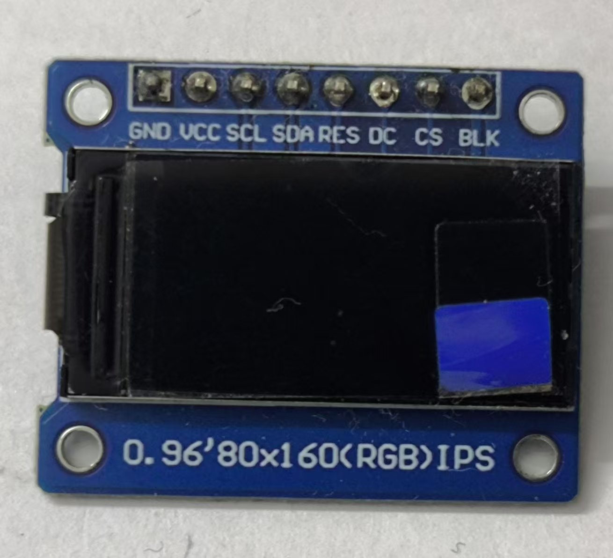
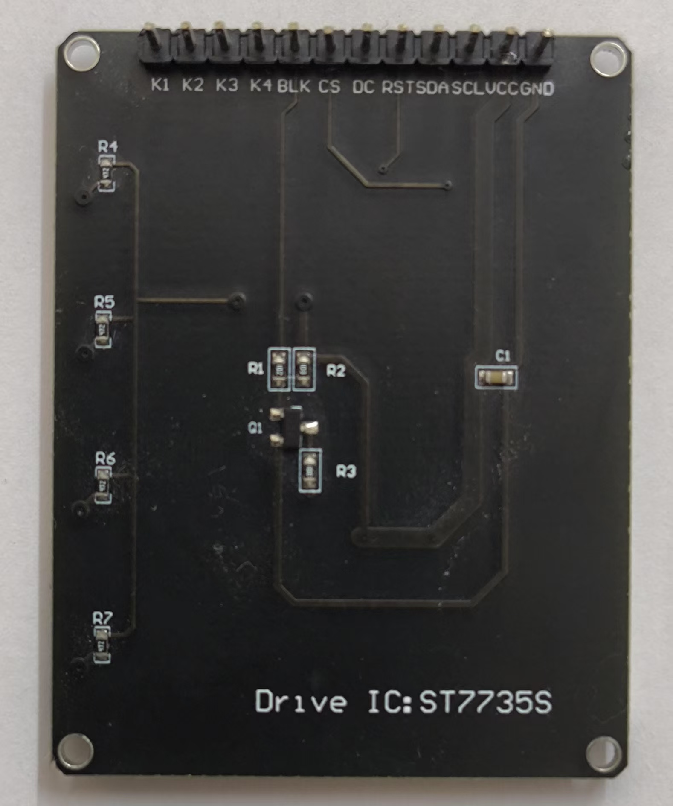
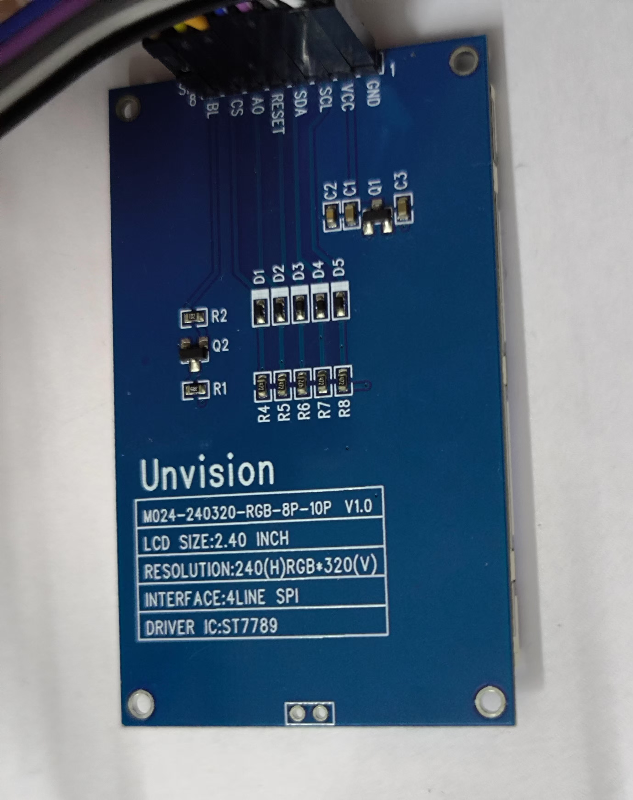

# ESP32 WiFi Screen

An ESP32-S2/S3 based WiFi display project that supports remote control of TFT displays via HTTP/WebSocket/MQTT.

[中文](README.md)

## Features

- **Multiple Display Support**: ST7735, ST7789, ST7796 series TFT displays
- **Multiple Communication Methods**: HTTP API, WebSocket, MQTT
- **Web Configuration Interface**: Configure WiFi and display parameters via browser
- **Image Transmission**: Supports JPEG, RGB565, LZ4 compression formats
- **Canvas Drawing**: Supports text, graphics, and image elements
- **Color Adjustment**: Real-time RGB channel adjustment to correct color cast issues

## Performance Benchmarks

### WiFi Transfer Speed (ESP32-S2 @ 240MHz + 2MB PSRAM)

| Protocol | Min Speed | Max Speed | Typical Speed | Notes |
|----------|-----------|-----------|---------------|-------|
| HTTP Echo | 120 KB/s | 694 KB/s | ~280 KB/s | Single request/response |
| WebSocket Echo | 128 KB/s | 751 KB/s | ~350 KB/s | Persistent connection, more stable |

> **Test Conditions**: 100KB round-trip echo test, WiFi 2.4GHz. Actual speed varies with signal strength and interference.

### Performance Notes

- **Peak Speed**: ~750 KB/s (6 Mbps), near ESP32-S2 WiFi theoretical limit
- **Speed Variance**: 2.4GHz WiFi interference causes speed fluctuations
- **WebSocket Advantage**: Persistent connection avoids HTTP overhead, higher average speed

## Hardware Requirements

- ESP32-S2 or ESP32-S3 development board (4MB Flash + 2MB PSRAM required)
- Supported TFT display (see wiring instructions below)

## Wiring Instructions

### Common Pin Definitions

| Display Pin | ESP32-S2 Pin | Description |
|-------------|--------------|-------------|
| GND | GND | Ground |
| VCC | 3V3 | Power 3.3V |
| SCL/CLK | GPIO6 | SPI Clock |
| SDA/MOSI | GPIO7 | SPI Data |
| RST/RES | GPIO8 | Reset |
| DC/AO | GPIO5 | Data/Command Select |
| CS | GPIO4 | Chip Select (required for some displays) |
| BL/BLK | NC or VBUS | Backlight (can connect to VBUS 5V) |

### Display Wiring Reference

#### ST7735S 80x160 (with CS)



```
GND -> GND
VCC -> 3V3
SCL -> GPIO6
SDA -> GPIO7
RST -> GPIO8
DC  -> GPIO5
CS  -> GPIO4
BLK -> (NC or VBUS)
```

#### ST7735S 128x160 (with CS)



```
GND -> GND
VCC -> 3V3
SCL -> GPIO6
SDA -> GPIO7
RST -> GPIO8
DC  -> GPIO5
CS  -> GPIO4
BL  -> (NC or VBUS)
```

#### ST7789 240x240 (no CS)


```
GND -> GND
VCC -> 3V3
SCL -> GPIO6
SDA -> GPIO7
RES -> GPIO8
DC  -> GPIO5
BLK -> (NC or VBUS)
```

#### ST7789 240x320 (with CS)



```
GND -> GND
VCC -> 3V3
SCL -> GPIO6
SDA -> GPIO7
RST -> GPIO8
AO  -> GPIO5
CS  -> GPIO4
BL  -> VBUS
```

#### ST7789V 135x240 (with CS)


```
GND -> GND
VCC -> 3V3
SCL -> GPIO6
SDA -> GPIO7
RES -> GPIO8
DC  -> GPIO5
CS  -> GPIO4
BLK -> (NC or VBUS)
```

#### ST7796 320x480 (with CS)


```
GND -> GND
VCC -> 3V3
SCL -> GPIO6
SDA -> GPIO7
RST -> GPIO8
DC  -> GPIO5
CS  -> GPIO4
BL  -> VBUS
```

> **Note**: Wiring diagrams are stored in the `images/` folder.

## Installation

### Method 1: Using espup (Recommended)

1. **Install espup tool**
   ```powershell
   cargo +stable install espup
   ```

2. **Install ldproxy linker**
   ```powershell
   # Temporarily unset project toolchain override
   rustup override unset
   
   # Install ldproxy
   cargo install ldproxy
   
   # Restore esp toolchain
   rustup override set esp
   ```

3. **Install ESP Rust toolchain**
   ```powershell
   espup install
   ```
   Note: If the installation hangs for more than 5 minutes, press Ctrl+C to interrupt - the toolchain is already installed.

4. **Configure project**
   
   a) **Set short path for build directory** (**Required** to resolve ESP-IDF path length errors)
   
   Edit `.cargo/config.toml`:
   ```toml
   [build]
   target = "xtensa-esp32s2-espidf"
   target-dir = "C:/t"  # Use short path, ESP-IDF requires short total path length
   ```
   
   Create directory:
   ```powershell
   New-Item -ItemType Directory -Path "C:/t" -Force
   ```

   b) **Configure sdkconfig path**
   
   Add to `[env]` section in `.cargo/config.toml`:
   ```toml
   [env]
   MCU="esp32s2"
   ESP_IDF_VERSION = "v5.3.2"
   ESP_IDF_SDKCONFIG_DEFAULTS = { value = "sdkconfig.defaults", relative = true }
   ```

   c) **Configure rustflags** (optional, this project uses pure Rust implementation)
   ```toml
   [target.xtensa-esp32s2-espidf]
   rustflags = [
       "--cfg",  "espidf_time64",
   ]
   ```

5. **Install espflash tool** (for flashing firmware)
   ```powershell
   cargo install espflash
   ```

6. **Set environment variables before each build**
   ```powershell
   . .\espup_env.ps1
   ```

7. **Build and flash**
   ```powershell
   # Method 1: Use build.ps1 script to compile and generate firmware
   . .\build.ps1
   
   # Method 2: Step by step
   # Build
   cargo build --release
   
   # Generate firmware file
   espflash save-image --chip esp32s2 --partition-table partitions.csv target/xtensa-esp32s2-espidf/release/esp32-wifi-screen esp32-wifi-screen.bin
   
   # Flash firmware to device
   espflash flash --monitor target/xtensa-esp32s2-espidf/release/esp32-wifi-screen
   
   # Or use flash.ps1 script
   .\flash.ps1
   ```

### Method 2: Using ESP-IDF Official Installer

1. **Download and install ESP-IDF 5.3**
   - Official site: https://dl.espressif.com/dl/esp-idf/index.html
   - Optionally install Rust related components

2. **Use ESP-IDF console**
   - Open ESP-IDF 5.3 CMD console
   - Navigate to project directory and build

## Common Commands

```powershell
# List available serial ports
espflash board-info

# Flash and monitor serial output
espflash flash --monitor target/xtensa-esp32s2-espidf/release/esp32-wifi-screen

# Flash to specific port
espflash flash --port COM3 target/xtensa-esp32s2-espidf/release/esp32-wifi-screen

# Erase flash
espflash erase-flash
```

## Build Scripts

All build scripts automatically read `target-dir` configuration from `.cargo/config.toml`.

| Script | Function |
|--------|----------|
| `build.ps1` | Compile project and generate `.bin` firmware file |
| `flash.ps1` | Compile, generate firmware, and flash to device |
| `monitor.ps1` | Monitor serial output (usage: `.\monitor.ps1 -p COM3`) |

**Recommended workflow**:
```powershell
# Build and generate firmware only
. .\build.ps1

# Or build + flash + monitor (all in one)
. .\flash.ps1
```

## Notes

- **Pure Rust Implementation**: This project uses pure Rust `tjpgd` library, no C library linking required
- **Path Length Limit**: ESP-IDF requires very short build output paths, **must** use `target-dir = "C:/t"` or similar
- **Network Proxy**: First build requires global proxy to access GitHub
- **First Build Time**: First build takes 10-30 minutes, please be patient

## Usage

1. After flashing, the device will create a WiFi hotspot named `ESP32-Screen-XXXXXX`
2. Connect to the hotspot and visit `http://192.168.72.1` to access configuration page
3. Configure WiFi and display parameters, then save
4. Device will restart and connect to specified WiFi, accessible via LAN

### Web Configuration Interface Features

**Display Settings**:
- Display model selection (ST7735s, ST7789, ST7796)
- Resolution configuration (width, height, X/Y offset)
- Display options (CS pin, color inversion, mirroring, coordinate mode)
- Rotation direction (0°, 90°, 180°, 270°, supports real-time switching)
- Color order (RGB/BGR) and SPI mode
- Preset configurations: Quick selection of common display models

**Network Settings**:
- WiFi scanning: Automatically scan and display nearby WiFi networks with signal strength
- WiFi configuration: SSID, password, static IP settings
- Real-time reconnection: Test new WiFi configuration without restart

**MQTT Remote Server**:
- MQTT server URL, client ID, username/password
- Subscription topic and QoS settings
- Supports real-time reconnection and configuration deletion

**Transfer Speed Test**:
- HTTP and WebSocket speed testing
- Selectable data sizes (10KB - 1MB)
- Real-time display of transfer speed and round-trip time

**Screen Test**:
- Example page for testing display effects

### Color Adjustment Feature

Some TFT screens may have color cast issues (too blue, too yellow, etc.). Use the "Color Adjustment" feature in the web configuration interface for real-time correction:


**Features**:
- **Real-time Effect**: Drag sliders to apply changes immediately to the screen, no restart required
- **Independent RGB Adjustment**: Adjust Red(R), Green(G), Blue(B) channels separately, range: -100 to +100
- **Quick Presets**: 4 preset options for common color cast corrections
  - **Fix Blue Cast**: Reduce blue channel (-30)
  - **Fix Yellow Cast**: Reduce red and green channels (R:-15, G:-15)
  - **Warm Tone**: Enhance red, reduce blue (R:+20, G:+10, B:-15)
  - **Cool Tone**: Reduce red, enhance blue (R:-15, B:+20)
- **Persistent Settings**: Adjusted values are automatically saved to device and persist after reboot

**How to Use**:
1. Find the "Color Adjustment" section in the configuration page
2. Drag R/G/B sliders or click preset buttons
3. Observe real-time effects on screen (300ms debounce delay)
4. Settings are automatically saved once adjusted

## License

MIT License
