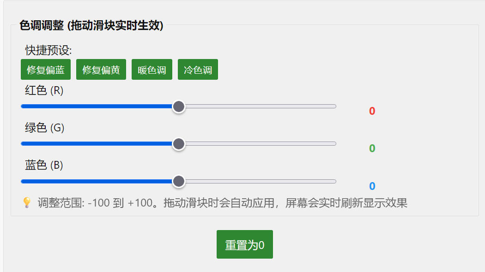

# ESP32 WiFi Screen

基于 **ESP32-S2 / ESP32-S3** 的小屏幕项目，支持通过 **WiFi**（HTTP/WebSocket/MQTT）或 **USB 串口** 高速传输图像并显示到 TFT 屏幕。

[English](README.en.md)

## 功能特性

- **多种显示屏支持**：ST7735、ST7789、ST7796 系列 TFT 显示屏
- **多种通信方式**：HTTP API、WebSocket、MQTT、USB 串口（ESP32-S2 USB CDC / ESP32-S3 USB Serial JTAG）
- **Web 配置界面**：通过浏览器配置 WiFi、显示屏参数
- **图像传输**：支持 JPEG、RGB565、LZ4 压缩格式
- **画布绘制**：支持文字、图形、图像等元素绘制
- **色调调整**：实时调整屏幕 RGB 通道，修正色偏问题

## 性能测试

### WiFi 传输速度（ESP32-S2 @ 240MHz + 2MB PSRAM）

| 协议 | 最低速度 | 最高速度 | 典型速度 | 备注 |
|------|----------|----------|----------|------|
| HTTP Echo | 120 KB/s | 694 KB/s | ~280 KB/s | 单次请求/响应 |
| WebSocket Echo | 128 KB/s | 751 KB/s | ~350 KB/s | 长连接，性能更稳定 |

> **测试条件**：100KB 数据往返测试（Echo），WiFi 2.4GHz，实际速度受信号强度和环境干扰影响。

### USB 串口传输速度（ESP32-S2/S3）

| 项目 | 主机侧吞吐 | 设备侧接收 | 备注 |
|------|------------|------------|------|
| USB 串口单向下行（SpeedTest） | ~462.6 KB/s | ~491.0 KB/s | chunk=4096，设备输出 `SPEEDRESULT;5050368;10045` |

> **说明**：USB 串口测速脚本位于 `examples/tools/`，设备侧会输出 `SPEEDRESULT;{bytes};{ms}` 作为统计结果。

### 性能说明

- **WiFi 峰值速度**：约 750 KB/s（6 Mbps），接近 ESP32-S2 WiFi 理论极限
- **WiFi 速度波动**：2.4GHz WiFi 环境干扰会导致速度波动
- **WebSocket 优势**：长连接避免了 HTTP 连接开销，平均速度更高
- **USB 串口典型速度**：约 450–500 KB/s（与主机驱动、串口栈缓冲、chunk 大小等有关）

## 硬件要求

- ESP32-S2 或 ESP32-S3 开发板（带 PSRAM，建议 4MB Flash + 2MB PSRAM）
- 支持的 TFT 显示屏（见下方接线说明）
- USB 数据线（用于烧写/日志/USB 串口传图）

## 接线说明

### 通用引脚定义

| 显示屏引脚 | ESP32 引脚 | 说明 |
|-----------|--------------|------|
| GND | GND | 接地 |
| VCC | 3V3 | 电源 3.3V |
| SCL/CLK | GPIO6 | SPI 时钟 |
| SDA/MOSI | GPIO7 | SPI 数据 |
| RST/RES | GPIO8 | 复位 |
| DC/AO | GPIO5 | 数据/命令选择 |
| CS | GPIO4 | 片选（部分屏幕需要） |
| BL/BLK | 悬空或 VBUS | 背光（可接 VBUS 5V） |

### 各屏幕接线参考

#### ST7735S 80x160（带 CS）


```
GND -> GND
VCC -> 3V3
SCL -> GPIO6
SDA -> GPIO7
RST -> GPIO8
DC  -> GPIO5
CS  -> GPIO4
BLK -> (悬空或 VBUS)
```

#### ST7735S 128x160（带 CS）


```
GND -> GND
VCC -> 3V3
SCL -> GPIO6
SDA -> GPIO7
RST -> GPIO8
DC  -> GPIO5
CS  -> GPIO4
BL  -> (悬空或 VBUS)
```

#### ST7789 240x240（无 CS）


```
GND -> GND
VCC -> 3V3
SCL -> GPIO6
SDA -> GPIO7
RES -> GPIO8
DC  -> GPIO5
BLK -> (悬空或 VBUS)
```

#### ST7789 240x320（带 CS）


```
GND -> GND
VCC -> 3V3
SCL -> GPIO6
SDA -> GPIO7
RST -> GPIO8
AO  -> GPIO5
CS  -> GPIO4
BL  -> VBUS
```

#### ST7789V 135x240（带 CS）


```
GND -> GND
VCC -> 3V3
SCL -> GPIO6
SDA -> GPIO7
RES -> GPIO8
DC  -> GPIO5
CS  -> GPIO4
BLK -> (悬空或 VBUS)
```

#### ST7796 320x480（带 CS）


```
GND -> GND
VCC -> 3V3
SCL -> GPIO6
SDA -> GPIO7
RST -> GPIO8
DC  -> GPIO5
CS  -> GPIO4
BL  -> VBUS
```

> **注意**：接线图片保存在 `images/` 文件夹中。

## 安装步骤

### 方式一：使用 espup 安装（推荐）

1. **安装 espup 工具**

```powershell
cargo +stable install espup
```

2. **安装 ldproxy 链接器**

```powershell
# 临时取消项目的工具链覆盖
rustup override unset

# 安装 ldproxy
cargo install ldproxy

# 恢复项目的 esp 工具链
rustup override set esp
```

3. **安装 ESP Rust 工具链**

```powershell
espup install
```

> 注意：如果安装过程卡住超过 5 分钟，按 Ctrl+C 中断即可，工具链可能已安装成功。

4. **配置项目**

a) **设置超短路径编译目录**（**必需**，解决 ESP-IDF 路径过长错误）

编辑 `scr/.cargo/config.toml`（在 `scr` 子项目目录下为 `.cargo/config.toml`）：

```toml
[build]
# ESP32-S2: xtensa-esp32s2-espidf
# ESP32-S3: xtensa-esp32s3-espidf
target = "xtensa-esp32s2-espidf"
target-dir = "C:/esp/target"  # 使用超短路径，ESP-IDF 要求总路径不超过特定长度
```

创建目录：

```powershell
New-Item -ItemType Directory -Path "C:/esp/target" -Force
```

b) **芯片选择与环境变量（推荐使用脚本）**

- **推荐**：直接使用仓库提供的构建脚本（会自动设置 `MCU` / `ESP_IDF_VERSION` / `ESP_IDF_SDKCONFIG_DEFAULTS` 等环境变量，并选择正确的 target/features）：
  - ESP32-S2：`build_esp32s2.ps1` / `flash_esp32s2.ps1`
  - ESP32-S3：`build_esp32s3.ps1` / `flash_esp32s3.ps1`
- **说明**：本项目固定使用 ESP-IDF `v5.3.4`；`rustflags` 已在 `scr/.cargo/config.toml` 中配置，一般无需手动调整。

5. **安装 espflash 工具（用于烧写固件）**

```powershell
cargo install espflash
```

6. **每次编译前设置环境变量**

```powershell
. .\\espup_env.ps1
```

7. **编译和烧写**

```powershell
# 方式 1（推荐）：按芯片使用脚本一键构建/烧写
.\build_esp32s2.ps1
.\flash_esp32s2.ps1

# ESP32-S3：
# .\build_esp32s3.ps1
# .\flash_esp32s3.ps1

# 方式 2：分步执行
# 编译
cargo build --release

# 生成固件文件
espflash save-image --chip esp32s2 --partition-table partitions.csv target/xtensa-esp32s2-espidf/release/esp32-wifi-screen esp32-wifi-screen.bin

# 烧写固件到设备
espflash flash --monitor target/xtensa-esp32s2-espidf/release/esp32-wifi-screen

# ESP32-S3：将 --chip / target 路径切换为 esp32s3 / xtensa-esp32s3-espidf，或直接使用脚本（推荐）
```

### 方式二：使用 ESP-IDF 官方安装器

1. **下载并安装 ESP-IDF 5.3.4**
   - 官网：`https://dl.espressif.com.cn/dl/esp-idf/index.html`
   - 可选择安装 Rust 相关组件

2. **使用 ESP-IDF 控制台**
   - 打开 ESP-IDF 5.3.4 CMD 控制台
   - 进入项目目录执行编译

## 常用命令

```powershell
# 查看可用串口
espflash board-info

# 烧写并监控串口输出
espflash flash --monitor target/xtensa-esp32s2-espidf/release/esp32-wifi-screen

# 指定串口烧写
espflash flash --port COM3 target/xtensa-esp32s2-espidf/release/esp32-wifi-screen

# 擦除闪存
espflash erase-flash
```

## 构建脚本说明

所有构建脚本都支持自动从 `.cargo/config.toml` 读取 `target-dir` 配置。

| 脚本 | 功能 |
|------|------|
| `build_esp32s2.ps1` | 构建 ESP32-S2 固件并生成合并镜像（`*-merged.bin`） |
| `flash_esp32s2.ps1` | 烧写 ESP32-S2 合并镜像（可选监控串口输出） |
| `build_esp32s3.ps1` | 构建 ESP32-S3 固件并生成合并镜像（`*-merged.bin`） |
| `flash_esp32s3.ps1` | 烧写 ESP32-S3 合并镜像（可选监控串口输出） |
| `monitor.ps1` | 监控串口输出（用法：`.\\monitor.ps1 -p COM3`） |

**推荐工作流**：

```powershell
# ESP32-S2：构建并生成镜像
.\build_esp32s2.ps1

# ESP32-S2：烧写（一步到位）
.\flash_esp32s2.ps1
```

## 注意事项

- **纯 Rust 实现**：本项目已使用纯 Rust 的 `tjpgd` 库，不再需要 C 库链接
- **路径长度限制**：ESP-IDF 要求编译输出路径极短，**必须**使用 `target-dir = "C:/esp/target"` 等超短路径（可按需改成更短，如 `C:/t`）
- **网络代理**：首次编译必须开启全局代理访问 GitHub
- **首次编译耗时**：首次编译需要 10-30 分钟，请耐心等待

## 使用说明

### WiFi 模式（原有）

1. 烧写固件后，设备会创建名为 `ESP32-Screen-XXXXXX` 的 WiFi 热点
2. 连接热点后，访问 `http://192.168.72.1` 进入配置页面
3. 配置 WiFi 和显示屏参数后保存
4. 设备重启后连接到指定 WiFi，可通过局域网访问

### USB 串口传图（新增）

**适用芯片**：
- **ESP32-S2**：TinyUSB CDC（固件启动后会输出 `READY:USB-CDC`）
- **ESP32-S3**：USB Serial JTAG（固件启动后会输出 `READY:HIGH_SPEED_RX`）

**上位机示例**：
- 示例工程在 `examples/`（默认 feature 为 `usb-serial`）
- `examples/src/main.rs` 会自动查找 usb-screen 设备（`find_usb_serial_device()`），并通过串口发送图像到屏幕

**串口通信协议（固件侧：`scr/src/usb_reader.rs`）**：

- **设备信息查询（ReadInfo）**：
  - 主机发送：`ReadInfo`（8 字节二进制）或 ASCII `ReadInfo\n`
  - 设备回复：`ESP32-WIFI-SCREEN;{width};{height};PROTO:USB-SCREEN`
- **图像帧传输（LZ4 + RGB565）**：
  - 帧头：`image_aa`（8 字节） + `width,height,x,y`（4 个 `u16`，Big-Endian，共 8 字节）
  - 负载：`lz4_flex::compress_prepend_size(rgb565_bytes)` 的输出
  - 帧尾：`image_bb`（8 字节）
  - 说明：固件会 LZ4 解压后按 `RGB565` 绘制到屏幕；为提升吞吐，固件默认关闭绘制相关的调试 ACK 回显
- **测速（SpeedTest）**：
  - 主机发送：`SPDTEST1`（8 字节） + 任意数据 + `SPDEND!!`（8 字节）
  - 设备回复：`SPEEDRESULT;{bytes};{ms}`（为提高可靠性会重复发送）
- **启动握手（可选）**：
  - 主机可等待固件输出 `READY:*` 后再开始发送数据

### Web 配置界面功能

**屏幕设置**：
- 显示屏型号选择（ST7735s、ST7789、ST7796）
- 分辨率配置（宽度、高度、X/Y 偏移）
- 显示选项（CS 引脚、色彩反转、镜像、坐标模式）
- 旋转方向（0°、90°、180°、270°，支持实时切换）
- 颜色顺序（RGB/BGR）和 SPI 模式
- 预设配置：快速选择常见屏幕型号

**网络设置**：
- WiFi 扫描：自动扫描并显示附近的 WiFi 网络及信号强度
- WiFi 配置：SSID、密码、静态 IP 设置
- 实时重连：无需重启即可测试新的 WiFi 配置

**MQTT 远程服务器**：
- MQTT 服务器 URL、客户端 ID、用户名/密码
- 订阅主题和 QoS 设置
- 支持实时重连和配置删除

**传输速度测试**：
- HTTP 和 WebSocket 速度测试
- 可选数据大小（10KB - 1MB）
- 实时显示传输速度和往返时间

**屏幕测试**：
- 提供示例页面测试显示效果

### 色调调整功能

部分 TFT 屏幕可能存在色偏问题（偏蓝、偏黄等），可以通过 Web 配置界面的"色调调整"功能实时校正：



**功能特点**：
- **实时生效**：拖动滑块即可实时应用到屏幕，无需重启
- **RGB 独立调整**：分别调整红色(R)、绿色(G)、蓝色(B)通道，范围：-100 到 +100
- **快捷预设**：提供 4 种预设方案快速修正常见色偏
  - **修复偏蓝**：降低蓝色通道 (-30)
  - **修复偏黄**：降低红绿通道 (R:-15, G:-15)
  - **暖色调**：增强红色，降低蓝色 (R:+20, G:+10, B:-15)
  - **冷色调**：降低红色，增强蓝色 (R:-15, B:+20)
- **配置保存**：调整后的数值会自动保存到设备，重启后保持

**使用方法**：
1. 在配置页面找到"色调调整"部分
2. 拖动 R/G/B 滑块或点击预设按钮
3. 观察屏幕实时效果（300ms 防抖延迟）
4. 调整满意后配置会自动保存

## License

MIT License

